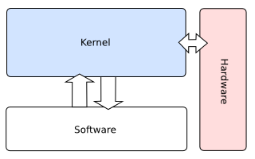

</img>

# Tic Tac Toe Kernel
<p align="justify"><b>Tic Tac Toe Kernel</b> is a project I created with Luka Budrak (<a href="https://github.com/Valyreon">@Valyreon</a>) in June of 2020, that has helped us gain better understanding of Kernel development. For some reason I never got around to opensourcing this project, <i>but there's no time like the present</i>.</p>

## Table of contents
- [Tic Tac Toe Kernel](#tic-tac-toe-kernel)
  - [Table of contents](#table-of-contents)
  - [Introduction](#introduction)
  - [Requirements](#requirements)
  - [Link file](#link-file)
  - [Boot code](#boot-code)
  - [Global Functions](#global-functions)
  - [Monitor code](#monitor-code)
    - [Moving the cursor](#moving-the-cursor)
  - [GDT and IDT](#gdt-and-idt)
    - [The Global Descriptor Table](#the-global-descriptor-table)
    - [The Interrupt Descriptor Table](#the-interrupt-descriptor-table)
  - [Booting the kernel](#booting-the-kernel)
    - [Building a bootable image](#building-a-bootable-image)
    - [OS testing](#os-testing)
  - [References](#references)
    - [Books](#books)
    - [Links](#links)
  - [To-Do List](#to-do-list)

## Introduction
<p align="justify">The idea behind this project was to develop a simple, beginner-friendly, UNIX-clone operating system for the x86 architecture. The created OS is <a href="https://en.wikipedia.org/wiki/Monolithic_kernel">monolithic</a> as this was the path of the least resistance while programming. Because of the aforementioned reasons, this is a very simple kernel because the used algorithms are not optimal or uttermost space efficient. The goal with this project was to gain basic knowledge on the kernel development and not to write the most efficient kernel possible. By writing this a hope I will inspire someone to write their own kernel. Because of the extensible nature of this kernel, you could use the provided code and easly build you kernel on top of this one.</p>


> **Note**:
> <ul><li>The first part of this README will focus on the explanation of the kernel development, while the second part will focus on the Tic Tac Toe game and the <a href="https://en.wikipedia.org/wiki/Decision_tree">Decision Tree</a>.</li>
> <li>The provided code contains a lot of comments, so if something isn't explained in README it is probably explained in the source code.</li>

## Requirements
<p align="justify">To compile and run this code you will need Linux, <a href="https://www.nasm.us/">GCC</a>, LD, GNU MAKE, <a href="https://www.nasm.us/">NASM</a> and <a href="https://www.google.com/search?client=firefox-b-d&q=QEMU">QEMU</a>. In order to fully understand everything that is written in this project you will need to have a very good knowledge of C and a pretty good understanding of <a href="https://www.google.com/url?sa=t&rct=j&q=&esrc=s&source=web&cd=&ved=2ahUKEwjitorE8Zz7AhXOxQIHHQ_RDHAQFnoECA4QAQ&url=https%3A%2F%2Fwww.intel.com%2Fcontent%2Fdam%2Fdevelop%2Fexternal%2Fus%2Fen%2Fdocuments%2Fintroduction-to-x64-assembly-181178.pdf&usg=AOvVaw2-KElAcG1rRPsv5rHn3UMw">assembly</a> (Intel syntax) as well as some basic knowledge of registers. Knowledge of Linux will be very helpful as the scripts and tutorial is tailor for it.</p>

## Link file
<p align="justify">This file tells LD (GNU Linker) how to set up our kernel image. For more information about the LD check out this <a href="https://ftp.gnu.org/old-gnu/Manuals/ld-2.9.1/html_mono/ld.html">link</a>. Firstly it tells that the start location of our binary should be the symbol <i>start</i>. The <b><a href="https://en.wikipedia.org/wiki/Code_segment">.text</a></b> section, the place where our code goes, should be first and should start at 0x100000 or 1 MB. The <b><a href="https://en.wikipedia.org/wiki/Data_segment">.data</a></b> section should be next, followed by the <b><a href="https://en.wikipedia.org/wiki/.bss">.bss</a></b> section while each should be page-aligned with <code>ALIGN(4K)</code>.</p>

> **Note**: The linker script specifies *start* as the entry point to the kernel and the
bootloader will jump to this position once the kernel has been loaded.

## Boot code
<p align="justify">To start you OS we will an existing piece of software to load it. This is called <a href="https://en.wikipedia.org/wiki/Bootloader">bootloader</a> and we have used <a href="https://www.gnu.org/software/grub/">GRUB</a> as goal of this project wasn't to develop our own bootloader. Unless you really want to develop a bootloader, I recommend using one of the already available bootloaders. The <i>boot.s</i> is a Kernel start location which also defines multiboot header. Multiboot Standard describes an interface between the bootloader and the OS kernel so we don't have to worry about that. It works by putting some magic values in some global variables inside of the multiboot header.</p>

https://github.com/AleksaMCode/tic-tac-toe-kernel/blob/1e8b7d2d27b90c7e5071ad87321d6a52f6cd4ce5/boot.s#L10-L14

<p align="justify">When the bootloader sees these values, it recognizes the kernel as multiboot compatible and it knows how to load us, and it can even forward us important information. Since there is no stack yet we need to make sure the global variables are set correctly.</p>

https://github.com/AleksaMCode/tic-tac-toe-kernel/blob/1e8b7d2d27b90c7e5071ad87321d6a52f6cd4ce5/boot.s#L2-L6

<p align="justify">The Multiboot Standard doesn't define the value of the stack pointer register ESP and it is up to kernel to provide a stack. We allocate room for a small stack by creating a symbol at the bottom of it (<code>stack_bottom</code>), allocating x amount of bytes and finally creating a symbol at the top (<code>stack_top</code>).</p>

```asm
mov esp, stack_top
```

<p align="justify">To set up a stack, we set the ESP register to point to the top of the stack. This is very important as program written in C cannont function without a stack. After which we put the computer into an infinite loop. We achieve this by:</p>
<ol>
<li>Disabling interrupts with <b>cli</b> (clear interrupt enable in eflags).</li>
<li>Waiting for the next interrupt to arrive with <b>hlt</b>.</li>
<li>Jumping to the <b>hlt</b> instruction if it ever wakes up due to a non-maskable interrupt occurring or due to system management mode.</li>
</ol>

> **Note**:
> <ul><li>The stack on x86 must be 16-byte aligned.</li>
> <li>The stack grows downwards on x86.</li>
> <li>The compiler will assume the stack is properly aligned and failure to align the stack will result in undefined behavior.</li>
> <li><b>CHECKSUM</b> field is defined such that when the magic number, the flags and this are added together, the total must be zero. It is for error checking.</li></ul>

## Global Functions
<p align="justify">We have defined few commonly-used global functions inside of the <i>common.c</i> and <i>common.h</i>. They contain function for writing to and reading from the I/O bus, strcmp, strcpy and strcat functions.

## Monitor code
### Moving the cursor
<p align="justify">First we calcualte linear offset of the x, y cursor coordinate after which we send this offset to the VGA controller that accepts the 16-bit location as two bytes.</p>

## GDT and IDT
<p align="justify">The GDT and the IDT are descriptor tables. They are arrays of flags and bit values describing the operation of either the segmentation system (in the case of the GDT), or the interrupt vector table (IDT).</p>

### The Global Descriptor Table
<p align="justify">The Global Descriptor Table (GDT) is a table in memory that defines the processor's memory segments. The GDT sets the behavior of the segment registers and helps to ensure that protected mode operates smoothly. Segmentation is built into the x86 architecture and it's impossible to get around it. With segmentation, every memory access is evaluated with respect to a segment. That is, the memory address is added to the segment's base address, and checked against the segment's length. The GDT is pointed to by a special register in the x86 chip, the GDT Register, or simply the GDTR. The GDTR is 48 bits long. The lower 16 bits tell the size of the GDT, and the upper 32 bits tell the location of the GDT in memory.

https://github.com/AleksaMCode/tic-tac-toe-kernel/blob/1e8b7d2d27b90c7e5071ad87321d6a52f6cd4ce5/gdt.s#L3-L15

Keep in mind that the GRUB sets a GDT up for you. The problem is that you don't know where that GDT is, or what's in it. So you could accidentally overwrite it. There are total of 6 segmentation registers (cs, ds, es, fs, gs and ss). Each holds an offset into the GDT. The GDT table contains a number of entries called Segment Descriptors. Each is 8 bytes long and contains information on the starting point of the segment, the length of the segment, and the access rights of the segment.</p>

https://github.com/AleksaMCode/tic-tac-toe-kernel/blob/1e8b7d2d27b90c7e5071ad87321d6a52f6cd4ce5/include/descriptor_tables.h#L9-L17

### The Interrupt Descriptor Table
<p align="justify">The Interrupt Descriptor Table (IDT) is a data structure used by the x86 architecture to implement an interrupt vector table. The IDT is used by the processor to determine the correct response to interrupts and exceptions.

Three general interrupt and exceptions sources:
<ul>
  <li>Exceptions</li>
  <li>Software interrupts</li>
  <li>External interrupts</li>
</ul>

Types of Exceptions:
<ul>
  <li>Faults - are precise exceptions reported on the boundary before the instruction causing the exception.</li>
  <li>Traps - are precise exceptions reported on the boundary following the instruction causing the exception.</li>
  <li>Aborts - are imprecise exceptions. Because they are imprecise, aborts typically do not allow reliable program restart.</li>
</ul>


Like the GDT the IDT is an array of 8-byte descriptors. Unlike the GDT the first entry of the IDT may contain a descriptor. It is just an array of entries, each one corresponding to an interrupt number. There are 256 possible interrupt numbers, so 256 must be defined. If an interrupt occurs and there is no entry for it (even a NULL entry is fine), the processor will panic and reset. The processor will sometimes need to signal your kernel. Something major may have happened, such as a divide-by-zero, or a page fault. To do this, it uses the first 32 interrupts. The special CPU-dedicated interrupts are shown below. </p>

<table>
  <tr>    <td>0</td>     <td>Division by zero exception</td> </tr>
  <tr>    <td>1</td>     <td>Debug exception</td>  </tr>
  <tr>    <td>2</td>     <td><a href="https://en.wikipedia.org/wiki/Non-maskable_interrupt">Non maskable interrupt</a></td>  </tr>
  <tr>    <td>3</td>     <td>Breakpoint exception</td>  </tr>
  <tr>    <td>4</td>     <td>Overflow</td>  </tr>
  <tr>    <td>5</td>     <td>Out of bounds exception</td>  </tr>
  <tr>    <td>6</td>     <td>Invalid opcode exception</td>  </tr>
  <tr>    <td>7</td>     <td>No coprocessor exception</td>  </tr>
  <tr>    <td>8</td>     <td><a href="https://en.wikipedia.org/wiki/Double_fault">Double fault</a></td>  </tr>
  <tr>    <td>9</td>    <td>Coprocessor segment overrun</td>  </tr>
  <tr>    <td>10</td>    <td>Invalid Task State Segment</td>  </tr>
  <tr>    <td>11</td>    <td>Segment not present</td>  </tr>
  <tr>    <td>12</td>    <td>Stack Segment Fault</td>  </tr>
  <tr>    <td>13</td>    <td><a href="https://en.wikipedia.org/wiki/General_protection_fault">General Protection Fault</a></td>  </tr>
  <tr>    <td>14</td>    <td><a href="https://en.wikipedia.org/wiki/Page_fault">Page fault</a></td>  </tr>
  <tr>    <td>15</td>    <td>Reserved</td>  </tr>
  <tr>    <td>16</td>    <td>x87 Floating Point Exception </td>  </tr>
  <tr>    <td>17</td>    <td>Alignment check exception</td>  </tr>
  <tr>    <td>18</td>    <td>Machine check exception</td>  </tr>
  <tr>    <td>19-31</td>    <td>Reserved</td>  </tr>
</table>

</p>

## Booting the kernel
### Building a bootable image
<p align="justify">You can create a bootable image containing the GRUB bootloader and your kernel using the program <b>grub-mkrescue</b>. First you neet to create a file called <i>grub.cfg</i> that contains:</p>

https://github.com/AleksaMCode/tic-tac-toe-kernel/blob/1e8b7d2d27b90c7e5071ad87321d6a52f6cd4ce5/isodir/boot/grub/grub.cfg#L1-L3

<p align="justify">To create a bootable image type in the following commands:</p>

```bash
mkdir -p isodir/boot/grub
mv kernel.bin isodir/boot/KernelXO.bin
mv grub.cfg isodir/boot/grub/grub.cfg
grub-mkrescue -o KernelXO.iso isodir
```

> **Note**: You can skip these steps and just use the iso image provided in this project, however you will use these instructions when creating your own kernel.

### OS testing
<p align="justify">After installing QEMU use the following command to start the <i>KernelXO.iso</i>:</p>

```bash
qemu-system-x86_64 -cdrom KernelXO.iso
```

## References
### Books
<ul>
  <li><p align="justify"><a href="https://www.intel.com/content/dam/www/public/us/en/documents/manuals/64-ia-32-architectures-software-developer-instruction-set-reference-manual-325383.pdf">Intel® 64 and IA-32  Architectures Software Developer’s Manual</p></a></li>
  <li><p align="justify"><a href="https://github.com/tuhdo/os01/blob/master/Operating_Systems_From_0_to_1.pdf">Tu, Do Hoang - <i>Operating System: From 0 to 1</i></p></a></li>
</ul>

### Links
<ul>
  <li><p align="justify"><a href="https://wiki.osdev.org/Main_Page">osdev.org wiki</a></p></li>
  <li><p align="justify"><a href="https://0xax.gitbooks.io/linux-insides/content/KernelStructures/linux-kernelstructure-1.html">Kernel Structures</a></p></li>
  <li><p align="justify"><a href="https://en.wikibooks.org/wiki/X86_Assembly/X86_Architecture">x86 Assembly/X86 Architecture</a></p></li>
</ul>

## To-Do List
- [ ] Complete README.md
- [ ] Implement Shutdown